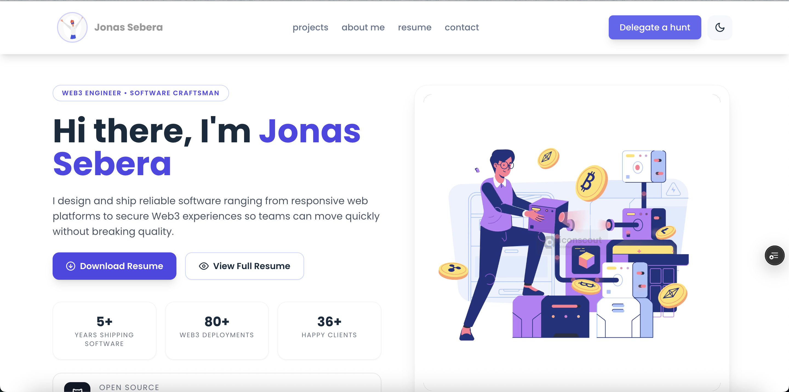
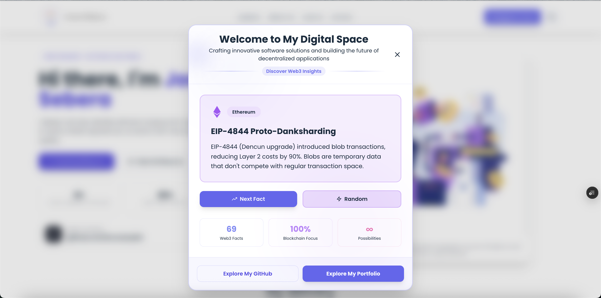

# Welcome To my Digital Space | Jonas Sebera

> A meticulously crafted personal brand experience built with production-ready front‑end patterns, fluid motion, and web3-native credibility.

---

## Support My Work

- Back the studio directly from the live site and unlock an on-chain supporter badge instantly.
- Every successful transaction now triggers a personal email alert so I can thank you faster.
- ETH, USDT, and badge download links are surfaced post-transaction, making bragging rights easy.
- Prefer sharing? Social buttons auto-compose LinkedIn, X, and WhatsApp shoutouts.
- Leave your email right after the transaction so I can respond with a tailored thank-you.

### Paid Resume Access

- `$0.50 USDT` per download, auto-converted to the live ETH rate via CoinGecko.
- Wallet signature + on-chain payment are required before the PDF link unlocks.
- Works across every supported chain (Base, Polygon, Arbitrum, Optimism, Mainnet).
- Prevents free riding by fetching the PDF through a signed, post-transaction fetch.

### 🔒 Security & Trust

**Bank-Level Security Guaranteed**: All transactions on this platform are protected with bullet-proof cryptographic verification signatures. Every payment is verified on-chain before any transaction executes, ensuring maximum security and transparency. Your payment is cryptographically verified—no transaction proceeds without full verification. **100% secure, 100% transparent.**

## Visuals

### Highlighted Projects

### For new Visitors

---

## Tech Stack

- **Core:** React 18, React Router, Context API, React Query
- **Styling:** Tailwind CSS 3, CSS Modules, styled-components
- **Animation & Media:** Framer Motion, Swiper, react-three-fiber, Three.js, LightGallery
- **Web3:** RainbowKit, wagmi, viem, Web3.js, Solidity
- **Tooling:** react-app-rewired, customize-cra, PostCSS, Tailwind CLI, Jest + React Testing Library
- **Blockchain Platform:** Ethereum, Layer2s (Base, Polygon, Arbitrum, Optimism)

## Security

This portfolio integrates Web3 payment functionality with enterprise-grade security measures. All transactions are cryptographically verified on-chain using bullet-proof verification signatures. For detailed security information, please see [SECURITY.md](./SECURITY.md).

## 💌 Support & Contact

- Email: <sebejaz99@gmail.com>
- [X(formerly Twitter)](https://x.com/0xJonaseb11)
- [Linkedin](https://linkedin.com/in/jonassebera)
- Portfolio: [0xJonaseb11.dev](https://0xjonaseb11.vercel.app)

---

© 2025 Jonas Sebera — All rights reserved. Redistribution of this codebase or associated assets is prohibited without explicit permission.
